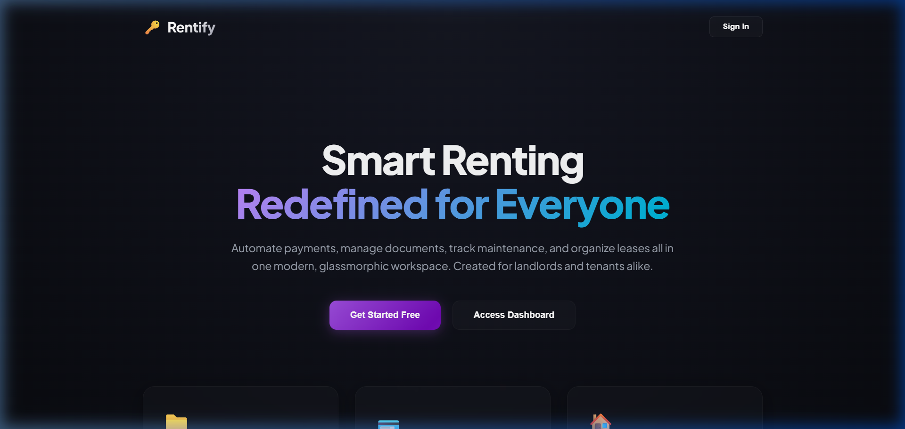
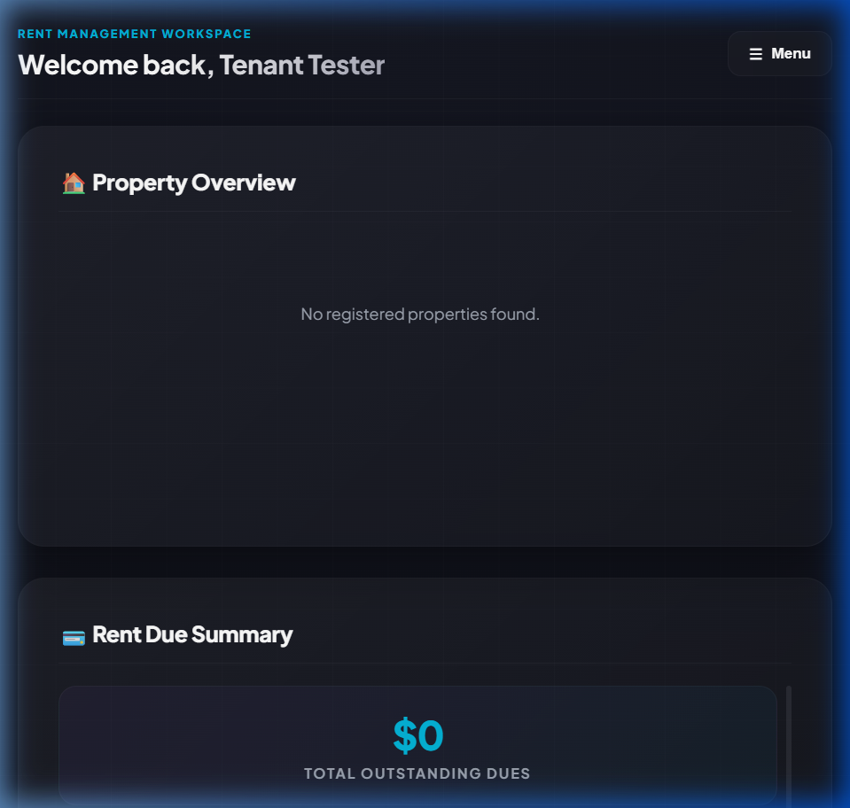

# 🔑 Rentify - Premium Rent Management System

Rentify is a modern, responsive, and secure Rent & Property Management System designed for **Landlords** and **Tenants**. Built with a premium glassmorphic interface, Rentify simplifies property registries, tenant leases, automatic invoice generation, expense tracking, and maintenance dispatching.

---

## 📸 Application Showcases

### 1. Landing Welcome Screen
A vibrant entry point for users to explore the application, sign up, or sign in.


### 2. Tenant Workspace Dashboard
A dedicated dashboard for tenants to view outstanding rent balances, settle bills via simulated checkouts, and view notifications.


---

## ⚡ Key Features

### 👥 Landlord Portal
*   **Property Portfolio Registry**: Add properties and suite lists (e.g., Room 101, 102), edit configuration details, and track vacant vs. occupied statuses.
*   **Assign Tenant Wizard**: A guided wizard to search tenants, select vacant suites, specify lease start/end dates, and automatically activate lease agreements.
*   **Rent Invoicing**: Issue rent invoices manually, log dues, and mark invoices as paid offline.
*   **Operational Expense Tracker**: Log outlays (Utilities, Maintenance, Taxes, Insurance) to maintain a complete property ledger.
*   **Intelligence & Reports**: View visual monthly charts for collected Rent Income, Expenses, Net Profit/Loss, and overall Portfolio Occupancy.
*   **Maintenance Dispatch**: Track tenant repair tickets, assign workers, update progress states, and prioritize actions.

### 👤 Tenant Portal
*   **Overview Panel**: Check outstanding rent dues and notifications at a glance.
*   **Simulated Rent Checkout**: Process rent invoices online with interactive instant payments.
*   **Maintenance Tickets**: Raise repair issues with detail inputs (Title, Description, Priority) and track status updates.

### ⚙️ Shared Platform Features
*   **Secure Authentication**: Role-based authentication (Landlord vs. Tenant) backed by JWT (JSON Web Tokens) and bcrypt password hashing.
*   **Profile Manager**: Update personal details (Name, Email, Phone) and customize system alerts (Rent due, Lease expiry, Maintenance, System alerts).
*   **Notification Center**: Comprehensive system activity logs sorted by tags.

---

## ⏳ Background Operations
Rentify comes with an integrated automated billing scheduler:
*   **Cron Job**: Runs automatically at **00:00 on the 1st of every month** (via `node-cron`).
*   **Processing**: Scans all active or renewed lease agreements and automatically generates rent invoices (`status: due`) for the current month.

---

## 🛠️ Technology Stack

*   **Frontend**: React 19, Vite, Axios, Custom Glassmorphic CSS.
*   **Backend**: Node.js, Express, MongoDB (Mongoose schemas), `jsonwebtoken`, `bcryptjs`, `node-cron`.

---

## ⚙️ Local Development Setup

### Prerequisites
*   Node.js (v18+)
*   MongoDB running locally or via MongoDB Atlas

### 1. Setup Backend
1. Go to the `backend` directory.
2. Create a `.env` file with the following variables:
   ```env
   PORT=5000
   MONGO_URI=mongodb://127.0.0.1:27017/rent-management-system
   JWT_SECRET=your_jwt_secret_token_key_here
   ```
3. Install dependencies and start the server:
   ```bash
   npm install
   npm start
   ```

### 2. Setup Frontend
1. Go to the `frontend` directory.
2. Install dependencies:
   ```bash
   npm install
   ```
3. Launch the Vite development server:
   ```bash
   npm run dev
   ```
4. Open the application in your browser at `http://localhost:5173`.
